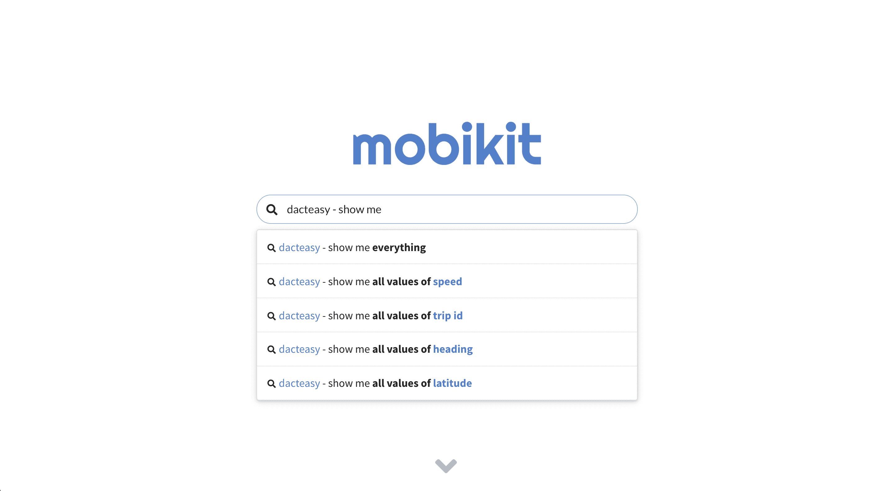
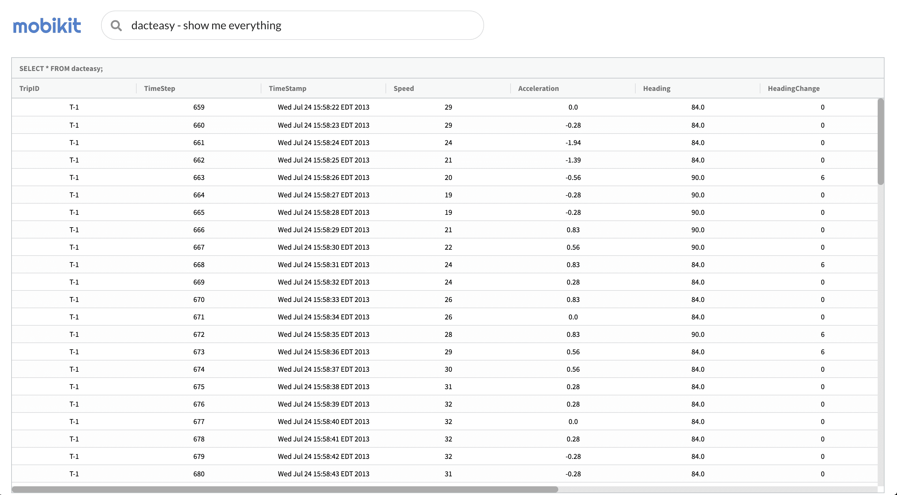

# DACT





<br/>

## Table of Contents

- [Introduction](#introduction)
- [Frontend](#frontend)
  - [Setup](#frontend-setup)
  - [AnalystBoxFrontend in Action](#analystboxfrontend-in-action)
- [Backend](#backend)
  - [Setup](#backend-setup)
  - [AnalystBoxBackend in Action](#analystboxbackend-in-action)

<br/>

## Introduction

Ask data a question as easily as you would ask Google! This demo shows off the full functionality of AnalystBoxFrontend and AnalystBoxBackend by letting you interact with the DACT dataset.

The dataset used here comes from [_Trajectory Annotation by Discovering Driving Patterns (UrbanGIS'17)_](https://dl.acm.org/citation.cfm?doid=3152178.3152184) and is available on [figshare](https://figshare.com/articles/dact_dataset_of_annotated_car_trajectories/5005289).

It contains 50 trajectories which cover about 13 hours of driving data. There are two subsets of annotated data - strict and easy. For the first one, strict constraints are used to aggregate crowd-sourcing results, while the second uses more flexibile ones.

<br/>

## Frontend

### <a name="frontend-setup"></a>Setup

_Follow along to get the demo up and running!_

1. Navigate to frontend

   ```shell
   $ cd path_to/dact/frontend
   ```

2. Install dependencies

   ```shell
   $ npm ci
   ```

3. Run
   ```shell
   $ npm run start
   ```

<br/>

### AnalystBoxFrontend in Action

_Here's what to look for in [HomePage](frontend/src/pages/HomePage.js#L91-L102) and [SearchPage](frontend/src/pages/SearchPage.js#L86-L97):_

```jsx
// ...
<AnalystBox
  base={{
    onFocus: this.disableKeyDown,
    onBlur: this.enableKeyDown,
  }}
  questions={this.props.questions}
  keywords={this.props.keywords}
  onQuestionSelect={this.onQuestionSelect}
  searchOptions={{
    engines: {
      triePrefixSearch: { shouldCache: false },
      linearSubstringSearch: {},
    },
  }}
/>
// ...
```

<br/>

## Backend

### <a name="backend-setup"></a>Setup

_Follow along to get the demo up and running!_

1. Navigate to backend

   ```shell
   $ cd path_to/dact/backend
   ```

2. Create venv

   ```shell
   $ python -m venv venv
   ```

3. Activate venv

   ```shell
   $ source venv/bin/activate
   ```

4. Install requirements

   ```shell
   $ pip install -r requirements.txt
   ```

5. Install AnalystBox

   ```shell
   $ pip install path_to/AnalystBoxBackend
   ```

6. Change database file path _(optional)_

   ```python
   DB_PATH = './data/demo.db'
   ```

7. Run

   ```shell
   $ python main.py

   $ python main.py path_to/file.db
   ```

<br/>

### AnalystBoxBackend in Action

_Here's what to look for in [main.py](backend/main.py#L17):_

```python
# ...

box = AnalystBox(DB_PATH, db_type='sqlite3', default_expansions=True)

# ...

@app.route('/data/qsts', methods=['GET'])
def data_qsts():
    questions, results, _ = box.get_qrks()
    return {'success': True, 'questions': questions, 'sqls': results}


@app.route('/data/keywords', methods=['GET'])
def data_keywords():
    _, _, keywords = box.get_qrks()
    return {'success': True, 'keywords': keywords}

# ...
```
