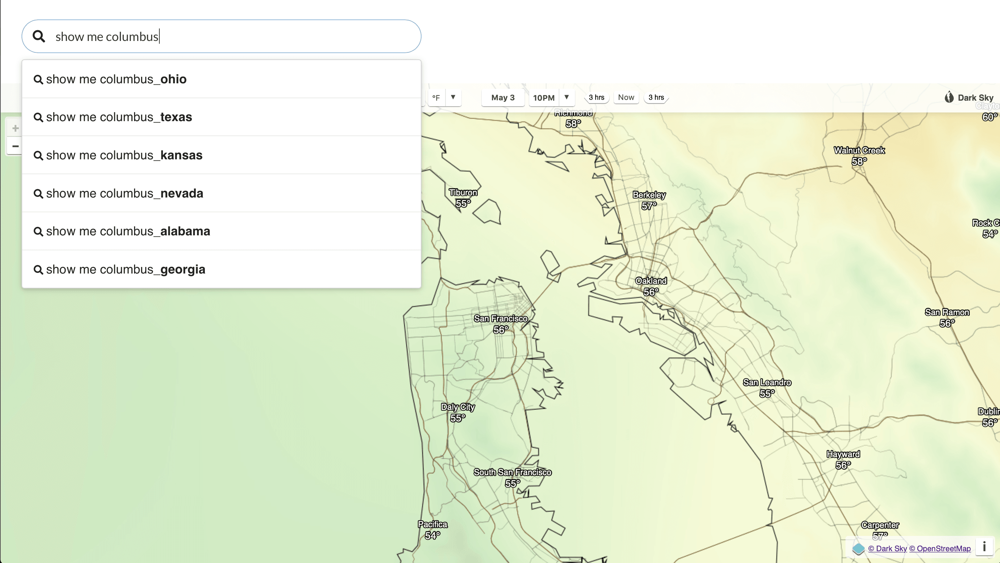

# DarkSky



<br/>

## Table of Contents

- [Introduction](#introduction)
- [Frontend](#frontend)
  - [Setup](#frontend-setup)
  - [AnalystBoxFrontend in Action](#analystboxfrontend-in-action)

<br/>

## Introduction

Explore the weather in other cities with [DarkSky Maps](https://darksky.net/). This simple example shows how easy it is to get started with AnalystBoxFrontend!

<br/>

## Frontend

### Setup

_Follow along to get the demo up and running!_

1. Navigate to frontend

   ```shell
   $ cd path_to/darksky/frontend
   ```

2. Install dependencies

   ```shell
   $ npm ci
   ```

3. Run
   ```shell
   $ npm run start
   ```

<br/>

### AnalystBoxFrontend in Action

_Here's what to look for in [App.js](frontend/src/App.js#L50-L63):_

```jsx
// ...
<AnalystBox
  questions={this.cities.map((city) => `show me ${city}`)}
  onQuestionSelect={({ questionIndex }) => {
    const [latitude, longitude] = this.latitudelongitudes[questionIndex];
    this.setState({ latitude, longitude });
  }}
  keywords={this.cities}
  searchOptions={{
    maxResults: 6,
    engines: {
      triePrefixSearch: { shouldCache: false },
      linearSubstringSearch: {},
    },
  }}
/>
// ...
```
